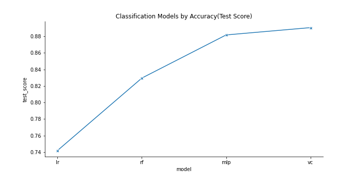
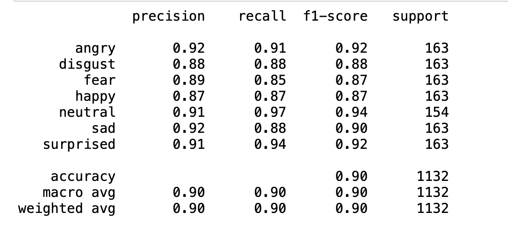
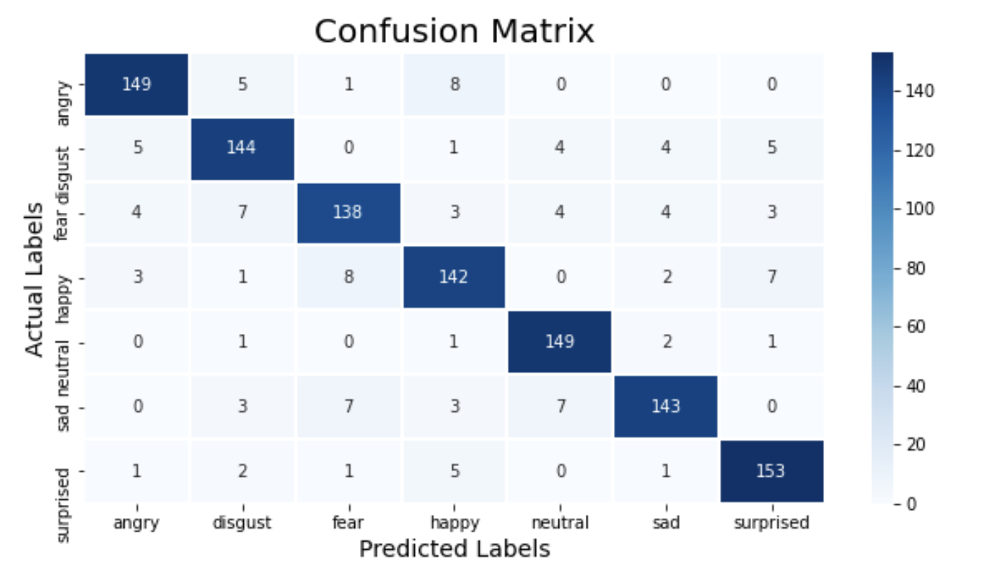

# Capstone - Speech Emotion Recognition


## Introduction:

Studies of automatic emotion recognition systems aim to create efficient, real-time methods of detecting the emotions of mobile phone users, call center operators and customers, car drivers, pilots, and many other human-machine communication users. Adding emotions to machines has been recognized as a critical factor in making machines appear and act in a human-like manner (André et al., 2004).


## Directory Structure
<details>
  <summary>Expand here</summary>

```
Capstone - Speech Emotion Recognition
|__ 01-A EDA_VoiceSentiment-RAVDESS.ipynb
|__ 01-B EDA_VoiceSentiment-TESS.ipynb
|__ 01-C EDA_VoiceSentiment-SAVEES.ipynb
|__ 02 VoiceSentiment-Feature_Extraction.ipynb
|__ 03-A SER_TraditionalML.ipynb
|__ 03-B SER_DeepLearning.ipynb
|__ 04-A VotingClass_Post-Model Testing.ipynb
|__ 04-B TF_Post-Model Testing.ipynb
|__ datasets
|   |__ train.csv      
|   |__ test.csv              
|__ README.md
|__ requirement.txt
```
</details>

# The Data Science Process

## Problem Statement:

We want to participate in the bidding for a Call Centre company for their quality assurance project, one part of this project is to analyse customer interactions,  the goal is to  detect emotions from  the customers and agents. This will help them  not only to analyse the customer behaviours but also how agents respond to customer’s emotion. 


This  project will serve as Proof of Concept, can we detect the 7 emotions from audio file?  ***Angry,  Disgust, Fear, Happy, Neutral, Sad, Surprised***

## Data Collection

[The Ryerson Audio-Visual Database of Emotional Speech and Song (RAVDESS)](https://zenodo.org/record/1188976#.YmlBpS8RoTs)

***Description***

The Ryerson Audio-Visual Database of Emotional Speech and Song (RAVDESS) contains 7356 files (total size: 24.8 GB). The database contains 24 professional actors (12 female, 12 male), vocalizing two lexically-matched statements in a neutral North American accent. Speech includes calm, happy, sad, angry, fearful, surprise, and disgust expressions, and song contains calm, happy, sad, angry, and fearful emotions. Each expression is produced at two levels of emotional intensity (normal, strong), with an additional neutral expression.

- For this project, we will only use *Audio-only files*

Audio-only files of all actors (01-24):
Speech file (Audio_Speech_Actors_01-24.zip, 215 MB) contains ***1440 files***: 60 trials per actor x 24 actors = 1440. 


[Toronto emotional speech set (TESS)](https://tspace.library.utoronto.ca/handle/1807/24487)

***Description***

- These stimuli were modeled on the Northwestern University Auditory Test No. 6 (NU-6; Tillman & Carhart, 1966). A set of 200 target words were spoken in the carrier phrase "Say the word _____' by two actresses (aged 26 and 64 years) and recordings were made of the set portraying each of seven emotions (anger, disgust, fear, happiness, pleasant surprise, sadness, and neutral). There are 2800 stimuli in total.


[Surrey Audio-Visual Expressed Emotion (SAVEE)Database](http://personal.ee.surrey.ac.uk/Personal/P.Jackson/SAVEE/Database.html)

***Description***

The SAVEE database was recorded from four native English male speakers (identified as DC, JE, JK, KL), postgraduate students and researchers at the University of Surrey aged from 27 to 31 years. Emotion has been described psychologically in discrete categories: anger, disgust, fear, happiness, sadness and surprise. This is supported by the cross-cultural studies of Ekman [6] and studies of automatic emotion recognition tended to focus on recognizing these [12]. We added neutral to provide recordings of 7 emotion categories. The text material consisted of 15 TIMIT sentences per emotion: 3 common, 2 emotion-specific and 10 generic sentences that were different for each emotion and phonetically-balanced. The 3 common and 2 × 6 = 12 emotion-specific sentences were recorded as neutral to give 30 neutral sentences. 


## Feature Extraction Using Librosa

Librosa is a python package for music and audio analysis. 184 features were generated using Librosa features.

       
    - Root Mean Square (1 feature)
    - Spectral Centroid (1 feature)
    - Spectral Rolloff (1 feature)
    - Zero Crossing Rate (1 feature)
    - Chroma STFT (12 features) 
    - MFCC  (40 features)
    - Mel Spectogram (128 features)

Data Augmentation - we augment our train data by trimming, adding noise and changing the pitch.


## Modeling and Tuning:

Using Optuna, we were able to get the best parameters For RandomForest, Logistic Regression and MLP Classifier.
Optuna is  automatic hyperparameter tuning framework that is completely written in Python.





Deep Learning model using CONV1D had a better accuracy of 90%.




### Confusion Matrix from TensorFlow's CONV1D, our best model:





# Summary:

We have successfully build  models using sklearn's Logistic Regression, Random Forest, MLP CLassifier, VotingClassifier and TensorFlow's deep learning using Conv1D.

MLP Classifier achieved  88% Accuracy. MLPClassifier stands for Multi-layer Perceptron classifier which in the name itself connects to a Neural Network. Unlike other classification algorithms such as Support Vectors or Naive Bayes Classifier, MLPClassifier relies on an underlying Neural Network to perform the task of classification that is completely written in Python.

VotingClassifier using two of our estimators -  RandomForest and MLP did slightly better with 89% accuracy. Voting classifier is a machine learning estimator that trains various base models or estimators and predicts on the basis of aggregating the findings of each base estimator. It used "soft" voting (if ‘hard’, uses predicted class labels for majority rule voting. Else if ‘soft’, predicts the class label based on the argmax of the sums of the predicted probabilities, which is recommended for an ensemble of well-calibrated classifiers)


Deep Learning has a remarkable 90% Accuracy! *Happy* has the lowest Precision of 87% and *fear* with lowest Recall of 85%. I listened to the wrong predictions, and it is really a challenge even for human to predict the actual emotion.


## Recommendation:

There are a lot more features from Librosa that were not included in the model, we can further analyze which features can help in getting better prediction.

For enhancement, this can be a two-step model, where we identify the gender first, then the emotions.


