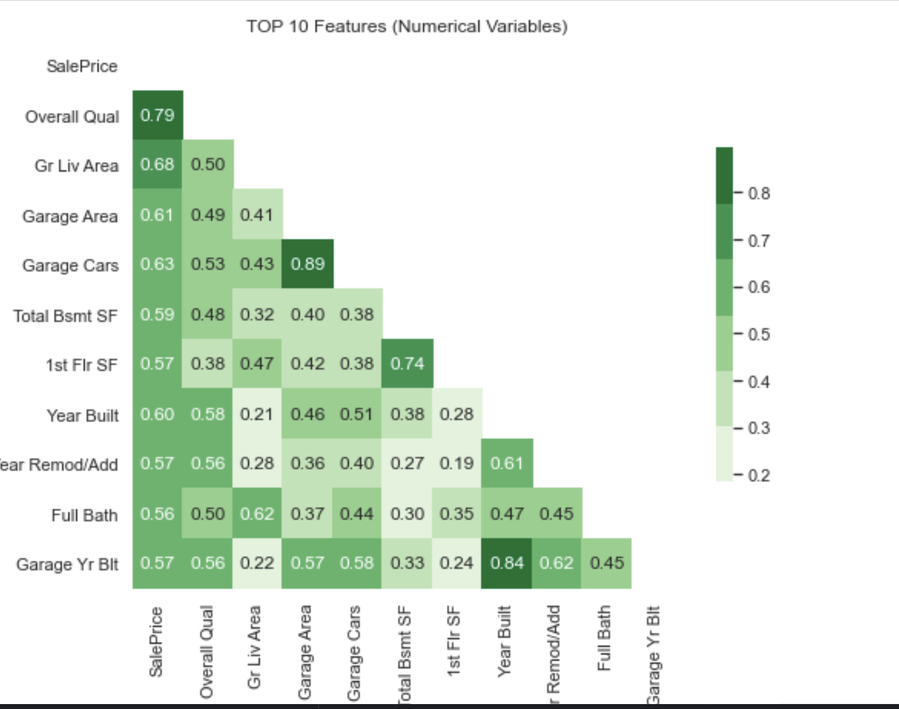
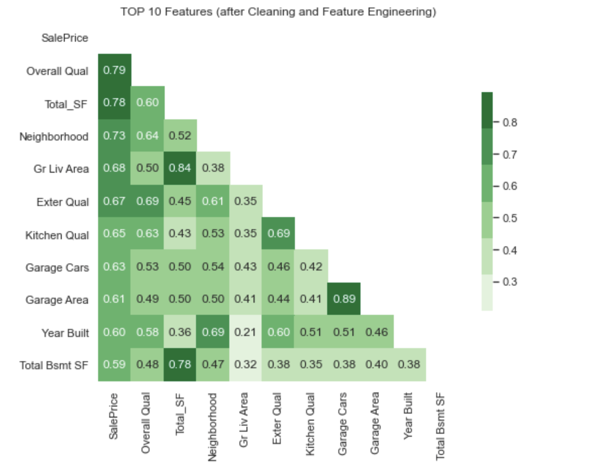

##  Ames Housing Data and Kaggle Challenge

The goal of this project is to predict the price of homes at sale for the Ames Iowa Housing dataset, which was provided by Kaggle in this [site](https://www.kaggle.com/c/dsi-us-11-project-2-regression-challenge/overview)

***Data Science Problem:*** To create models that closely estimate the SalePrice of the property. By exploring the dataset with 80 attributes related to the sale of the property, we will gain insight of which variables drives the Sale Price and create several regression models by selecting set of fields through iterative process, and choose the best one that can closely estimate the sale price.

***Business Problem:*** To be able to help the buyers decide on how they can choose their property depending of their budget, and their options for the  Neighborhood and overall quality . Refer to the "Project 2 _ Ames Housing Data and Kaggle Challenge.pptx" for the presentation.

To better understand the dataset, refer to this [data description](http://jse.amstat.org/v19n3/decock/DataDocumentation.txt).

In this project, we will do basic cleaning and imputation of null values, exploratory data analysis, feature engineering and build several regression models, and choose the best one with the highest accuracy and lowest root mean squared error.


# Directory Structure
<details>
  <summary>Expand here</summary>'


```
AMES_RegressionModels
|__ code
|   |__ 01_EDA_and_Cleaning-final.ipynb   
|   |__ 02_Preprocessing_and_Feature_Engineering-final.ipynb   
|   |__ 03_Model_Benchmarks_Tuning-KaggleModel.ipynb
|   |__ 04A_04A_Ames_Subset Selection in Python.ipynb
|   |__ 04B_Model_Benchmarks_Tuning-TopTenFeature.ipynb
|   |__ 05_Kaggle_Submissions.ipynb
|__ datasets
|   |__ train.csv      (provided by kaggle)
|   |__ test.csv       (provided by kaggle)
|   |__ train_preproc_final.csv   (output from 01_EDA_and_Cleaning-final.ipynb)
|   |__ test_preproc_final.csv    (output from 01_EDA_and_Cleaning-final.ipynb)
|   |__ train_wfeatures.csv       (output from 02_Preprocessing_and_Feature_Engineering-final.ipynb)
|   |__ test_wfeatures.csv        (output from 02_Preprocessing_and_Feature_Engineering-final.ipynb)
|   |__ nominaldict.json          (output from 02_Preprocessing_and_Feature_Engineering-final.ipynb, it is used to saved the rank of the features, based on the mean SalePrice)
|   |__ submit_lreg.csv           (output from 3_Model_Benchmarks_TUning-KaggleModel.ipynb, for submission to Kaggle)
|   |__ submit_ridgeregreg.csv    (output from 3_Model_Benchmarks_TUning-KaggleModel.ipynb, for submission to Kaggle)
|   |__ submit_lassoreg.csv       (output from 3_Model_Benchmarks_TUning-KaggleModel.ipynb, for submission to Kaggle)
|   |__ submit_enetreg.csv        (output from 3_Model_Benchmarks_TUning-KaggleModel.ipynb, for submission to Kaggle)
|__ image
|   |__ top10_eda.png
|   |__ top10_featureEng.png
|   |__ kaggle_submission.png
|   |__ regression_model_summary.png
|__ README.md
|__ Project 2 _ Ames Housing Data and Kaggle Challenge.pptx
```

</details>

# Data Cleaning and Imputation

  Those features with 80% of data has null values were dropped. The 4 features that were removed during the process - Alley,Pool QC, Misc Feature,Fence.
  The distribution of target variable, SalePrice is right skewed, and the outliers were dropped as well.

  Categorical features are populated with 'missing' as value, and numerical with 0.  

## Top 10 features (Numerical Variables) after Cleanup and Imputation



# EDA
For EDA, we focus on the Overall Qual, as this is the feature with highest correlation with SalePrice.
We sampled 3 different neighborhood with different Overall Qual rating and how the SalePrice is affected by this feature.

- NAmes has the most number of properties sold from 2006-2010, the average Overall Quality is between 5-6 hand as SalePrice  below 50% quantile, which means that it has above average quality and lower price, makes it more appealing to a lot of buyers.

- CollgCR is the second sellable, and the quality is between 6-7, and it  has average SalepPrice > 50% quantile.

- Somerst, has the average Overall Quality of 7-8, and it's average SellingPrice is above 75% quantile.


# Feature Engineering
  - ***Ordinal Features*** are transformed using the dictionary that shows their ordinal values (manually created)
   - ***Nominal Features*** are transformed using the dictionary that is automtically created from train dataset by  ranking the the mean of SalePrice, the same dictionary is used for Test, if the value is not in the train dataset, it will populate as 0

 - Feature Engineering:
   - ***HouseAge*** is calculated based on the Year the house is build, minus the Year it was sold.
   - ***Total_SF*** =  We added 'Gr Liv Area' and 'Total Bsmt SF'
   - ***Remodel_Age*** = 'Year Sold' minus the 'Year Remod/Add' 
   - ***is_Remodeled*** = if the Remodel_Age <=5 then 1 (Yes), else 0 (No)

## Top 10 features (after feature engineering)



# Regression Models for all features

Several models were built with Polynomial Features using cross_validate, LassoCV, RidgeCV, ElasticNetCV and also used RandomSearchCV to search for the optimal alpha. Below is the summary of the result for each regression models, with 79 fields (3,159 after Polynomial features are added). Ridge with alpha of 453.53 have the highest score (r2) and lowest root mean squared error (rmse)


# Regression Models for Top 10 features
For the top 10 features, we used forward and backward stepwise selection, and combine the result to get the best subset selection. It is not possible to get the best subset selection using all features (due the huge number of combination of models to be created and the time it takes as the number of features to be included is getting higher and higher) so we use forward and backward first, then combine and use the best subset selection:

### Best Subset Selection (result from the Top10 Forward and Top10 Backward Stepwise Selection)
- Total_SF          
- Neighborhood     
- Overall Qual     
- Bsmt Unf SF       
- Kitchen Qual    
- Garage Area        
- Fireplace Qu     
- Overall Cond    
- Yr Sold          
- Year Built        


### Lasso with alpha of 25.35 has the highest score (r2) **91.63%** and lowest rmse of 17.6K. It was a good result considering this only a selection of 10 features,  compared to 78 features (with Polynomials is 3159 total features) that has score/accuracy of **92.91%**

# Summary and Recommendation:

***Data Science Summary and Recommendation:*** *Recommendation is limited to the scope of this project*. Subset selection seems to be a good consideration for feature selections. Polynomial features help increase the prediction accuracy, however the models are more difficult to interpret. Linear Regression with polynomial features performs best in train dataset, but poorly in the test dataset, means that it is overfitting. It is better to use Ridge and Lasso models for datasets with Polynomial features.

***Business Problem Summary and Recommendation:***  Buyer can choose Neighborhood with slightly above average overall quality and price is below average.
For more details, please refer to "Project 2 _ Ames Housing Data and Kaggle Challenge.pptx"
